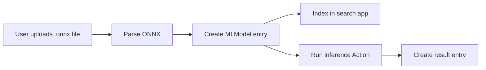

## Overview

This document describes the design for adding ML model support to NOMAD through
the `nomad-ml-workflows` plugin. The design introduces a dedicated `MLModel`
entry type together with parsing and inference support for ONNX-based model
artifacts.

The objective is to make ML models:

- representable as structured NOMAD entries
- searchable in a dedicated search app
- reusable across uploads and workflows
- linkable to training artifacts, datasets, and downstream analysis
- executable for inference through a controlled NOMAD Action

## Context

NOMAD already manages structured scientific data, workflows, and provenance.
ML models are increasingly used as scientific artifacts in their own right and
need comparable support:

- a base schema for metadata and artifact references
- a searchable representation in the NOMAD UI (with entries and apps)
- a safe way to derive structured metadata from uploaded model files
- a reusable interface for inference-oriented workflows

In addition to building schema for ML models, the current design also focuses on loading ONNX models because it offers a practical and relatively safe path for both metadata extraction and runtime execution without depending on framework-specific checkpoint loading.

## Goals

- Define a extendable `MLModel` schema for model entries
- Make `MLModel` entries searchable through a dedicated search app
- Provide parsing of `.onnx` files into `MLModel` entries through entry normalization
- Provide a generic inference Action for `MLModel` entries backed by `.onnx`
artifacts

## Non-Goals

- Establish a universal metadata standard for ML models
- Support parsing or inference for PyTorch, TensorFlow, JAX, or scikit-learn
artifacts
- Implement explicit training workflows for ML models inside this feature
- Infer complete provenance automatically from model contents
- Implement import/export integrations for Hugging Face or similar registries

## Interfaces

- Create entry
    - Users can create an `MLModel` entry manually and fill in metadata.
    - When `.onnx` files are uploaded as artifacts, entry normalization loads them and automatically populates the fields.
- Search App
    - Users can search, filter, and inspect available ML model entries.
- Run inference
    - Users can trigger an Action that runs inference for a selected ONNX-backed
    model using provided inputs.

These interfaces are consistent with the NOMAD model of uploads/projects,
entries, and Actions, so the new feature fits naturally into existing workflows.

## `MLModel` schema

`MLModel` should be implemented as a top-level NOMAD schema entry using `Entity` and `Schema`. The schema remains NOMAD-native and is not a direct copy of an external ML
metadata standard.

The schema should separate three concerns:

- user-authored descriptive metadata
- artifact-level technical metadata extracted from files
- execution-related metadata required for inference
- training-related metadata and provenance

Recommended content of the schema:

- Core metadata
    - title or model name
    - description
    - task
    - library
    - library version
    - architecture or model family
    - model version
- Artifact metadata
    - reference to one or more model files
    - artifact format
    - checksum
    - file size
- Inference metadata
    - whether inference is available (`.onnx` based entries should have this)
    - runtime type (`.onnx` based entries should have `onnxruntime`)
    - input tensor summary
    - output tensor summary
- Linkage metadata
    - references to training datasets
    - references to workflows or related entries
    - references to evaluation results
- Training metadata
    - optimizer specifications
    - learning rates
    - epochs
    - batch size

## Search App configurations

The search app should make `MLModel` entries easy to discover and compare.

Search behavior should support the main usage patterns:

- finding reusable models for downstream analysis
- identifying ONNX-backed models that can be executed directly
- filtering models that contain links to training or evaluation context

Recommended filters:

- task
- library
- architecture or model family
- artifact format
- inference availability
- linked training metadata

Recommended columns:

- model name
- task
- library
- artifact format
- inference available
- creation time or upload time

## ONNX: why support it?

ONNX is a strong first target because it serves both portability and inference.

Reasons to support ONNX first:

- It can represent models exported from multiple ML frameworks.
- It is better suited for safe ingestion than native checkpoint formats (from PyTorch, Tensorflow) that may rely on unsafe unpickling.
- It provides a common inference-oriented representation across otherwise
heterogeneous training stacks.

Important limitations:

- ONNX is not the canonical source for retraining a model. Exporting into ONNX usually does not preserve optimizer state, scheduler state, or framework-specific checkpoint semantics.

## ONNX parsing

Parsed when `MLModel` entry containing `.onnx` artifacts is processed

- Runs on `internal` task queue, parsing will compete with general NOMAD processing.

Expected parser responsibilities:

- inspect `.onnx` files without executing model code using `onnx.checker.check_model`
- extract basic artifact and graph metadata
- Populate `MLModel` entry with parser-derived information

Fields that should be populated when available:

- file reference
- artifact format set to ONNX
- checksum
- file size
- model graph name
- input tensor names, shapes, and dtypes
- output tensor names, shapes, and dtypes
- parser notes if metadata is incomplete or partially unavailable

Parsing rules:

- The parser must not guess semantic metadata such as a task or reconstruct training provenance from the ONNX graph alone.
- User-supplied metadata should take precedence over parsed data in certain cases (use `merge_section` utils like in other ELN measurement parser).

## ONNX inference runtime

Inference should be exposed as a NOMAD Action operating on an existing `MLModel` entry that references an ONNX artifact. Optionally, it should be possible to trigger this Action from the model entry.

Expected Action responsibilities:

- validates the model
- inspect `.onnx` artifacts without executing model code using checksum and `onnx.checker.check_model`
- validate the inputs
- run the inference using `onnxruntime`
- create or overwrite entries with inference results

Inputs to the Action:

- model entry
- inputs for inference
    - key-value pairs - this can be looked up by the action to find any relevant inference settings
    - ordered list, or
    - references to existing entries / sections

Input validation against the model input layer should include required input presence, dtype compatibility, shape compatibility, including dynamic dimensions where applicable.

Output handling should capture raw inference, reference to the model used, and the execution time.

Inference rules:

- Inference is only enabled for entries with a valid ONNX artifact
- Runtime execution must fail clearly when the artifact or inputs are invalid
- The first version should prioritize a generic execution path over
model-specific pre-processing or visualization

## Code ownership

- `nomad-FAIR`
    - provides the generic Action and workflow infrastructure used by the plugin (already available)
    - support for referencing or selecting entries in Action forms (implementation TBD)
    - support for triggering specific Action from inside an Entry (implementation TBD)
- `nomad-ml-workflows`
    - owns the `MLModel` schema
    - owns ONNX parsing implementation
    - owns ONNX inference Action
    - owns the ML model search app configuration

## Docs ownership

- NOMAD main documentation should provide a short overview of ML model support
and link to plugin-specific documentation.
- `nomad-ml-workflows` documentation should own the detailed schema, parsing,
inference, and usage guidance.
