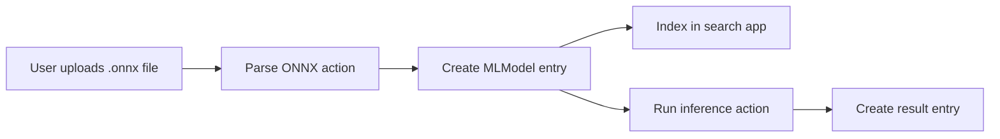

# ML Models in NOMAD

## Overview

This document describes the design for adding ML model support to NOMAD through
the `nomad-ml-workflows` plugin. The design introduces a dedicated `MLModel`
entry type together with parsing and inference support for ONNX-based model
artifacts.

The objective is to make ML models:

- representable as structured NOMAD entries
- searchable in a dedicated search app
- reusable across uploads and workflows
- linkable to training artifacts, datasets, and downstream analysis
- executable for inference through a controlled NOMAD action

## Context

NOMAD already manages structured scientific data, workflows, and provenance.
ML models are increasingly used as scientific artifacts in their own right and
need comparable support:

- a stable schema for metadata and artifact references
- a searchable representation in the NOMAD UI
- a safe way to derive structured metadata from uploaded model files
- a reusable interface for inference-oriented workflows

The current design focuses on ONNX because it offers a practical and relatively
safe path for both metadata extraction and runtime execution without depending
on framework-specific checkpoint loading.

## Goals

- Define a NOMAD-native `MLModel` schema for model entries
- Make `MLModel` entries searchable through a dedicated search app
- Provide automated parsing of `.onnx` files into `MLModel` entries
- Provide a generic inference action for `MLModel` entries backed by `.onnx`
  artifacts

## Non-Goals

- Establish a universal metadata standard for ML models
- Support parsing or inference for PyTorch, TensorFlow, JAX, or scikit-learn
  artifacts
- Implement explicit training workflows for ML models inside this feature
- Infer complete provenance automatically from model contents
- Implement import/export integrations for Hugging Face or similar registries

## `MLModel` schema

`MLModel` should be implemented as a top-level NOMAD schema entry. It should be
general enough to represent models created manually by users and models derived
from supported parsers.

The schema should separate three concerns:

- user-authored descriptive metadata
- artifact-level technical metadata extracted from files
- execution-related metadata required for inference

Recommended content of the schema:

- Core metadata
  - title or model name
  - description
  - task
  - framework
  - framework version
  - architecture or model family
  - version
- Artifact metadata
  - reference to one or more model files
  - artifact format
  - checksum
  - file size
- Inference metadata
  - whether inference is available
  - runtime type
  - input tensor summary
  - output tensor summary
- Linkage metadata
  - references to training datasets
  - references to workflows or related entries
  - references to evaluation results

Design rules:

- The schema remains NOMAD-native and is not a direct copy of an external ML
  metadata standard.
- Automatically extracted fields must be limited to metadata that can be read
  safely and deterministically.
- Missing metadata is preferable to guessed metadata.
- The schema must support manual entry creation even when no parser is used.

## Search App configurations

The search app should make `MLModel` entries easy to discover and compare
without exposing parser internals as the primary user interface.

Recommended filters:

- task
- framework
- architecture or model family
- artifact format
- inference availability
- linked training metadata

Recommended columns:

- model name
- task
- framework
- artifact format
- inference available
- creation time or upload time

Search behavior should support the main usage patterns:

- finding reusable models for downstream analysis
- identifying ONNX-backed models that can be executed directly
- filtering models that contain links to training or evaluation context

## ONNX: why support it?

ONNX is a strong first target because it serves both portability and inference.

Reasons to support ONNX first:

- It can represent models exported from multiple ML frameworks.
- It is better suited for safe ingestion than native checkpoint formats that may
  rely on unsafe unpickling.
- It provides a common inference-oriented representation across otherwise
  heterogeneous training stacks.

Important limitations:

- ONNX is not the canonical source for retraining a model. Exports usually do not preserve optimizer state, scheduler state, or framework-specific checkpoint semantics. Therefore, supporting ONNX does not imply support for training continuation in NOMAD.

The design therefore treats ONNX primarily as:

- a metadata source for safe parser-based entry creation
- an interchange artifact
- an inference artifact

## ONNX parsing

Parsing should be implemented as an action that processes existing `.onnx`
files in an upload and generates corresponding `MLModel` entries.

Expected parser responsibilities:

- inspect `.onnx` files without executing model code
- extract basic artifact metadata
- extract model graph metadata that is directly available from the ONNX file
- create or update an `MLModel` entry with parser-derived information

Fields that should be populated when available:

- file reference
- artifact format set to ONNX
- checksum
- file size
- model graph name
- input tensor names, shapes, and dtypes
- output tensor names, shapes, and dtypes
- parser notes if metadata is incomplete or partially unavailable

Parsing rules:

- The parser must not attempt to reconstruct training provenance from the ONNX
  graph alone.
- The parser must not guess semantic metadata such as scientific task or model
  purpose if it is not explicitly present.
- User-supplied descriptive metadata should remain editable after parsing.
- Batch parsing should support all `.onnx` files in an upload.

Resulting user flow:

- user uploads one or more `.onnx` files
- user triggers the parse action for the upload
- plugin creates `MLModel` entries
- entries become searchable and usable for inference
- user supplements the entries with additional metadata

## ONNX inference runtime

Inference should be exposed as a generic NOMAD action operating on an existing
`MLModel` entry that references an ONNX artifact.

The action should:

- allow the user to select a model entry
- allow the user to provide input values directly in the action form
- support selecting inputs from existing NOMAD entries
- populate an entry with key-value pairs or specify value as references to data fields of existing entries (TBD)
- validate provided inputs against the model signature
- execute inference using ONNX Runtime
- store the inference result in a newly created NOMAD entry

Input validation should include:

- required input presence
- tensor count
- dtype compatibility
- shape compatibility, including dynamic dimensions where applicable

Output handling should:

- capture raw inference outputs
- store them in a structured or rich-text-compatible result quantity
- include metadata about the model used and the execution time

Design constraints:

- inference is only enabled for entries with a valid ONNX artifact
- runtime execution must fail clearly when the artifact or inputs are invalid
- the first version should prioritize a generic execution path over
  model-specific pre-processing or visualization

## Interfaces

- Create entry
  - Users can create an `MLModel` entry manually and fill in metadata without
    parser support.
- Parse `.onnx` file
  - Users can trigger an action that parses all `.onnx` files in an upload into
    `MLModel` entries.
- Search App
  - Users can search, filter, and inspect available ML model entries.
- Run inference
  - Users can trigger an action that runs inference for a selected ONNX-backed
    model using provided inputs.

These interfaces should be consistent with the NOMAD model of uploads/projects,
entries, and actions, so the new feature fits naturally into existing workflows.

## Code ownership

- `nomad-FAIR`
  - provides the generic action and workflow infrastructure used by the plugin (already available)
  - support for referencing or selecting entries in action forms (implementation TBD)
- `nomad-ml-workflows`
  - owns the `MLModel` schema
  - owns ONNX parsing actions
  - owns ONNX inference actions
  - owns the ML model search app configuration

## Docs ownership

- NOMAD main documentation should provide a short overview of ML model support
  and link to plugin-specific documentation.
- `nomad-ml-workflows` documentation should own the detailed schema, parsing,
  inference, and usage guidance.
