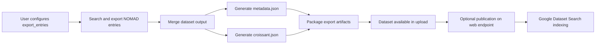

# Adding support for publishing ML-ready datasets in NOMAD

## Overview

This document describes the design for exporting ML-ready datasets from NOMAD
together with a Croissant metadata file through the `nomad-ml-workflows`
plugin. The feature extends the existing `export_entries` Temporal workflow so
that exported datasets are not only downloadable from NOMAD, but also easier to
interpret, exchange, and expose to web-based dataset discovery systems.

The objective is to make exported datasets:

- interoperable outside NOMAD
- self-describing through machine-readable metadata
- easier to reuse in ML workflows
- easier to publish as web-visible dataset assets
- compatible with downstream indexing such as Google Dataset Search

## Context

NOMAD already provides structured search and export capabilities for entries.
That is sufficient for internal reuse and bulk data extraction, but not yet
enough for broad dataset interoperability on the web.

For ML-oriented datasets, users often need:

- a downloadable dataset artifact
- a structured description of the dataset schema and distribution
- dataset-level metadata that can be understood outside NOMAD
- a path to publication that enables discovery through standard web indexing

Croissant addresses part of this need by providing a JSON-LD based format for
describing datasets, their contained resources, and their fields in a way that
is consumable by external tools.

The current `export_entries` workflow already creates:

- one merged dataset file in `parquet`, `csv`, or `json`
- a `metadata.json` file describing export conditions
- an upload-local packaged artifact, either zipped or as a directory

This makes `export_entries` the natural place to add Croissant export support.

## Goals

- Export ML-ready datasets together with a Croissant metadata file
- Reuse the existing `export_entries` Temporal workflow as the execution path
- Represent the exported NOMAD dataset as a web-interoperable dataset package
- Preserve enough field-level metadata to support external reuse
- Create exports that can be published in a way that is indexable by Google
  Dataset Search

## Non-Goals

- Define a full internal NOMAD dataset schema for all ML dataset types
- Make all NOMAD exports automatically public on the web
- Guarantee indexing by Google or other search engines
- Provide dataset hosting infrastructure outside NOMAD
- Perform semantic harmonization of arbitrary NOMAD fields into domain-specific
  ML ontologies
- Replace the existing export formats with Croissant-only exports

## Why Croissant?

Croissant is a practical target for dataset interoperability because it is
designed to describe datasets in a structured, machine-readable, and
web-compatible way.

Reasons to support Croissant:

- It provides a standard dataset description that is external to NOMAD.
- It can describe files, record sets, and fields in a way that downstream tools
  can interpret.
- It is compatible with web publication patterns based on JSON-LD.
- It is relevant for dataset discoverability and exchange in ML-oriented
  ecosystems.

Croissant should be treated in this design as:

- a metadata companion for an exported dataset
- a portability layer for dataset description
- a publication-oriented artifact, not a replacement for NOMAD-native metadata

## Dataset package design

The exported dataset package should contain:

- the merged dataset file
  - `data.parquet`, `data.csv`, or `data.json`
- `metadata.json`
  - existing NOMAD export metadata describing search settings and export
    conditions
- `croissant.json`
  - the Croissant description of the exported dataset

If `zip_output=true`, these files should be bundled into one zip archive. If
`zip_output=false`, they should be written into the exported directory in the
upload.

Design rules:

- The merged dataset file remains the primary data payload.
- Croissant describes the exported dataset package; it does not replace the
  payload file.
- NOMAD-specific metadata and Croissant metadata should coexist rather than be
  merged into one file.
- The package should remain usable even if some fields cannot be mapped cleanly
  into Croissant.

## Croissant

The Croissant file should describe the exported dataset at dataset level, file
distribution level, and field level where possible.

Recommended dataset-level content:

- dataset name
- description
- creator or publisher information where available
- license where available
- keywords or tags where available
- creation or export date
- link back to the originating NOMAD resource

Recommended distribution-level content:

- exported file name
- file format
- encoding or MIME type where appropriate
- file size when available
- checksum when available

Recommended record-set or field-level content:

- logical table or record-set name
- exported field names
- field descriptions when available
- data types inferred from the exported schema
- references to source NOMAD paths where useful

Design rules:

- The Croissant file should describe the exported dataset artifact, not the
  entire source upload.
- Fields should be mapped conservatively; unmappable fields may remain
  undocumented rather than guessed.
- Nested or highly irregular structures may need a simplified representation in
  the Croissant file.
- The first version should prioritize correctness and completeness of dataset
  packaging over perfect semantic richness.

## Croissant export

Croissant export should be implemented as an additional Temporal activity in the
`export_entries` workflow.

Expected activity responsibilities:

- inspect the merged output artifact
- derive a dataset-level description from workflow input and export metadata
- derive field-level information from the merged file schema where possible
- generate `croissant.json` in the workflow artifact directory
- return the generated file path for inclusion in the final package

Preferred inputs to the activity:

- path to the merged dataset file
- output file type
- export metadata collected by the workflow
- original search settings and required fields
- optional publication metadata supplied by the user in a later extension

Expected outputs:

- path to `croissant.json`
- optional warnings about partial field mapping or unsupported structures

Implementation approach by output format:

- `parquet`
  - use the Arrow or Parquet schema as the primary source for field definitions
- `csv`
  - use the merged CSV header and, where needed, the intermediate Parquet schema
    already used in the workflow
- `json`
  - use exported keys conservatively; avoid expensive or unreliable deep schema
    inference for heterogeneous records

Design constraints:

- Croissant generation must not require loading the entire exported dataset into
  memory.
- The activity should be deterministic for the same export inputs.
- Croissant generation must tolerate incomplete metadata.
- Failures in Croissant generation should be reported clearly. Whether they fail
  the whole export or degrade to export-without-Croissant is an explicit product
  decision.

Recommended first product decision:

- if the merged dataset export succeeds but Croissant generation fails, keep the
  dataset export and record the Croissant error in metadata rather than losing
  the full export

## Connection with export entries workflow

The current `export_entries` workflow already has a clear structure:

- collect page cursors
- fetch search results in parallel
- merge batch files into one dataset file
- write metadata
- package the exported artifacts back into the upload

Croissant export fits naturally after file merging and before final packaging.

Recommended workflow placement:

1. Search pages and write intermediate files
2. Merge intermediate files into one dataset artifact
3. Generate `croissant.json` from the merged artifact and workflow metadata
4. Package `data.*`, `metadata.json`, and `croissant.json`
5. Save the resulting archive or directory back into the upload

This design keeps the workflow responsibilities separate:

- existing search activities remain focused on data extraction
- Croissant generation is isolated in its own activity
- final packaging remains the responsibility of the existing export step

Recommended model extensions:

- add a workflow option to enable or disable Croissant generation
- add fields for publication-oriented metadata if the current search settings are
  insufficient
- add metadata fields for Croissant generation status and warnings

## Visibility on Google Dataset Search index

Google Dataset Search does not index arbitrary files stored inside a NOMAD
upload by default. Indexability depends on how the exported dataset is published
on the web.

To make exported datasets visible to Google Dataset Search, the publication
setup should provide:

- a stable public URL for the dataset landing page
- public access to the Croissant metadata or equivalent structured metadata
- crawlable web pages without access restrictions
- sufficient dataset-level metadata such as title, description, and publisher

Important boundary:

- generating `croissant.json` improves interoperability and prepares the dataset
  for web publication
- it does not by itself guarantee search engine indexing

Recommended publication model:

- NOMAD generates the dataset package and Croissant file
- a public NOMAD page or external publication endpoint exposes the dataset
- that page links to the downloadable artifacts and structured metadata
- search engines discover and index the public page

## User interfaces

- Export dataset from search
  - Users run the existing `export_entries` action with a query and output
    format.
- Include Croissant metadata
  - Users optionally enable Croissant generation as part of the same export.
- Download or reuse in NOMAD
  - Users receive the exported dataset package in the upload.
- Publish externally
  - Users or operators expose the package through a public dataset landing page.

The first version should keep the UI simple and reuse the existing export action
rather than creating a separate dataset publication action.

## Operational considerations

Croissant generation is metadata-heavy but lighter than the search export
itself. Even so, the design should account for scale and robustness.

Key considerations:

- field extraction should use file schema metadata when available
- nested structures may need flattening or string-based representation in some
  exports
- zipped exports should keep filenames predictable for downstream consumers
- public publication requires stable URLs, which may depend on NOMAD deployment
  policy rather than plugin code alone

## Code ownership

- `nomad-FAIR`
  - provides the generic Action and Temporal workflow infrastructure already
    used by `export_entries`
  - may later provide shared dataset publication infrastructure if needed
- `nomad-ml-workflows`
  - owns the Croissant generation activity
  - owns any workflow-model extensions specific to ML dataset export
  - owns documentation and packaging conventions for ML-ready dataset exports

## Docs ownership

- NOMAD main documentation should provide a short overview of dataset export and
  publication capabilities.
- `nomad-ml-workflows` documentation should own the detailed design and usage of
  Croissant-enabled ML dataset exports.
